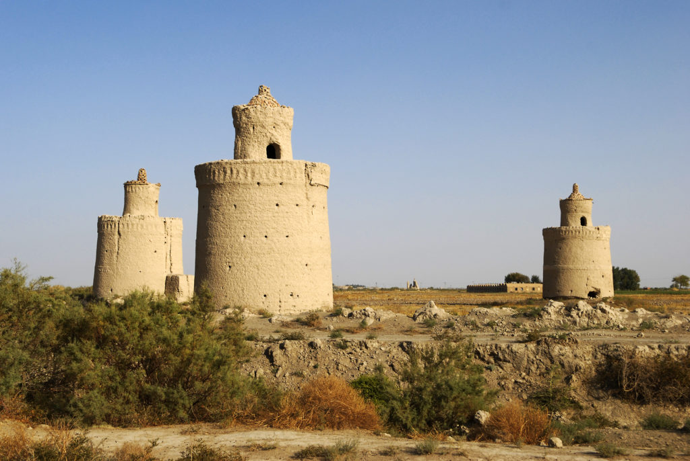

The **towers for pigeons** are widespread in the areas around **Isfahan** and **Golpayegan** and even today these buildings characterise the landscape. They are often imposing structures that can sometimes be mistaken for a defensive system. The earliest **towers** in the province of Isfahan date back to the 16th-17th centuries.

### Structural types

The external structure of the towers is very basic and simple. They are buildings that have parallelepipedal and cylindrical shapes, slightly tapered towards the top. But if the parallelepipedal type, distinctive of the [**Golpayegan area**](https://it.wikipedia.org/wiki/Golpayegan), does not have any structural variant, the cylindrical structure type can takes several forms. The towers are mainly built in mud bricks but also in baked bricks.

**European travelers** from the **17th century** noticed the pigeon towers leaving descriptions in their diaries, fascinated by size and grandeur of the buildings that contrast with their real function.

The cylindrical pigeons towers have a **diameter** that can reach **25 meters** and a **height** that is close to **20 meters**.

---
>**“On compte plus de trois mille colombiers autour d’_Ispahan_, tous faits moins pour nourrir des pigeons, que pour avoir le fumier, comme je l’ai observé. Ils l’appellent _tchalgous_, c’est-à-dire _animant_“**  
>>_Voyages de Mr. le chevalier Chardin en Perse et autres lieux de l’Orient_, vol. 4, Amsterdam 1711, pp. 85-86
---

The descriptions by **Jean Chardin** in his Voyages en _Perse et autres lieux_ de l’_Orient_ travelling in Persia from 1673 to 1677 or by **Thomas Herbert**, in his book _Travels in Persia 1627-29_, among the various European travelers in Iran, tell us how the towers were built to attract huge flocks of wild pigeons, numbering in the thousands. Chardin estimated there were more than 3000 pigeon towers in and around Isfahan.

### What are these towers for?

In the beginning farmers found utility in pigeons for food and eggs, but soon they realized that the real richness was their guano for valuable fertilizer. For this reason, the pigeons towers were built so that thousands of pigeons could breed in them accumulating droppings in the bottom of the tower.

The function of the towers was the collection of the pigeon guano that was used to fertilize fields of melons and watermelons. Both the towers and the pigeons belonged to the landowner.

### A closer look: internal and external structures

The **internal walls** of the pigeons towers are characterized by the presence of **niches** for the birds, distributed in regular and geometric way on all surfaces. The niches are obtained by avoiding the laying of a few rows of bricks for short sections of the surface.

All the surfaces were used for the niches, except the space occupied by the access door for collecting the guano; for some windows and for the stairs useful for inspection and maintenance.

On the external structure we rarely find windows and when they are there, windows are screened by openwork walls to prevent birds of prey from entering. Furthermore on the roof there may be one or more openwork turrets to let the light in, for air exchange and for the access of pigeons.

The towers are covered with _pisé_ except for a central plastered band, often colored in white or red, used to discourage the reptiles from climbing. Also, the decorative band projecting on the top of the tower has the same function.
