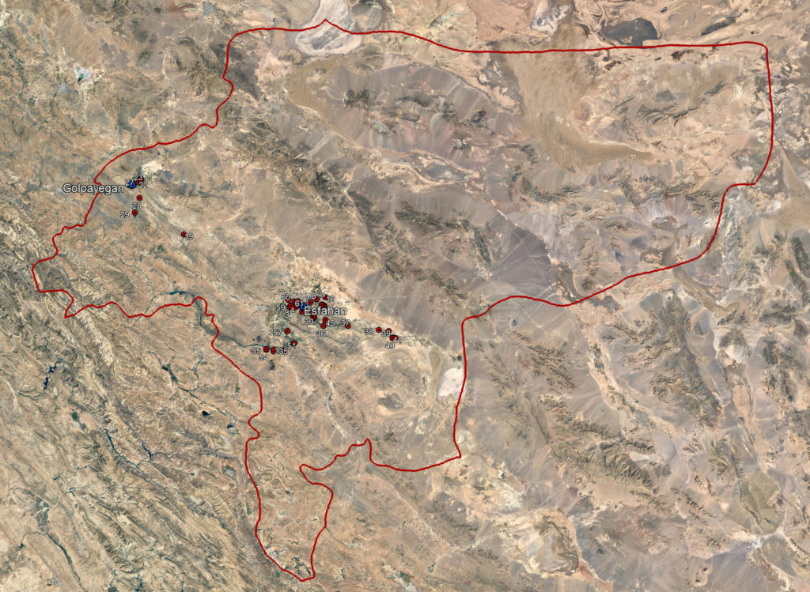

A preliminary survey of the pigeons towers was carried out in September 2008 by the [ISMEO](https://www.ismeo.eu/) researcher, **Danilo Rosati**, the photographer **Gaetano Pezzella** with the collaboration of **Dr. Fariba Saiedi Anaraki** (Institute for Cultural Heritage and Tourism, ICHHTO). “**Borj-e Kabotar**” is a research project between Italy and Iran, financially supported by ISMEO - Associazione Internazionale di Studi sul Mediterraneo e l’Oriente and Italian Ministry of Foreign Affairs and International Cooperation.

The first survey in the province of Isfahan aimed to investigate the pigeons towers, a vernacular architecture in mudbricks, trying to identify some important aspects:

- distribution on the territory
- typology
- state of conservation

As it can be seen [here](./towers), the pigeons towers can be classified in several typologies, often of imposing size, that strike the skyline also when are included into the urban fabric.

In-depth research of historical and architectural sources is essential. An attempt will try to investigate whether their dating dates back to the Safavid period. It will verified the theory according to which they could be structures imported by craftsmen and architects from Azerbaijan.

### A first report

The map highlights the centers around which the greatest number of pigeons towers were identified during the survey in 2008. They are focused on the area of the oasis of Isfahan crossed by the Zayandè river and its tributaries and on the westernmost area of the current province, the greenest and most irrigated, around Golpayegan.

The pigeons houses that have been documented are highlighted in red. We recorded in our system almost **one hundred** towers working for **five days** on the field along **six hundred kilometers** in the oasis.

### Project goals

The pigeons towers are well-known and so loved by the Iranian people who have given them the dignity of a cultural monument. Actually, some pigeon towers inside Isfahan have been restored and it is possible to visit them. In some villages they have become the historical monument of reference, a tangible link with the past.

One of the most important project aims is to **investigate the pigeon towers and their link with the local economy**. They were used until the 1960s, when they were abandoned due to the use of chemical fertilizers and also because of social and economic changes.

An **ethnographic research** on the field will enrich the understanding of pigeon towers, their socio-cultural implications in the territory and in the local economy. Social investigation will be carried out through open interviews with local informants identified with the help of the Iranian partner.

All of the interviews will focus on the technical knowledge, its transmission from generation to generation, the oral and material culture related to these peculiar buildings.

### Step by step

The research is divided into 3 main steps for the study of the pigeons towers from a historical, architectural and anthropological point of view:

- study of the historical and cultural aspects of these buildings linked to the local economy;
- survey and geolocation, identification and analysis of structural and construction typologies, architectural and decorative elements with graphic and photographic documentation of the towers;
- ethnographic field research aimed at identifying the main aspects of oral and material culture related to the construction and use of these buildings, investigating their functional and symbolic aspects.

The census of the still existing buildings will be fundamental, starting from the pigeons towers localized by the 2008 survey and a check of the remaining ones. After georeferencing them, all of the buildings will be studied in connection with the road network for a better understanding of the main dynamics of the territory.
